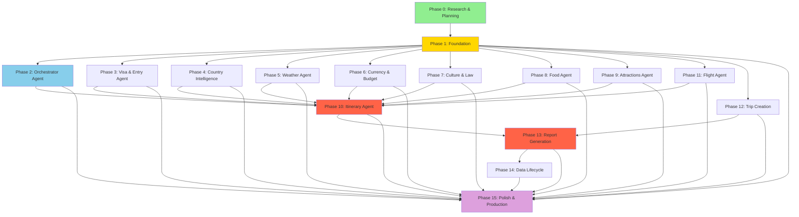
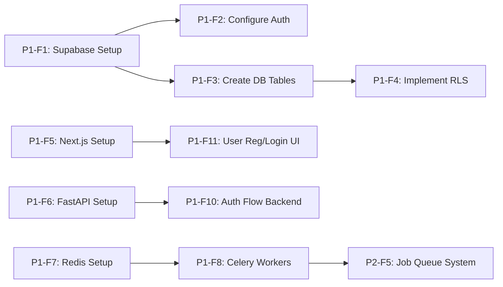
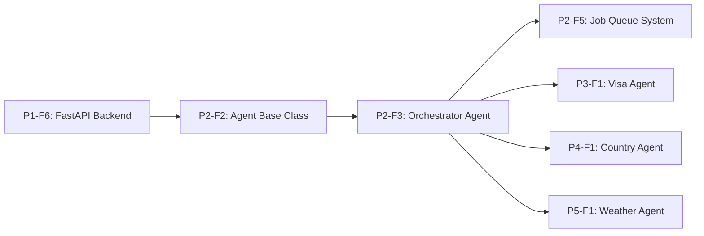
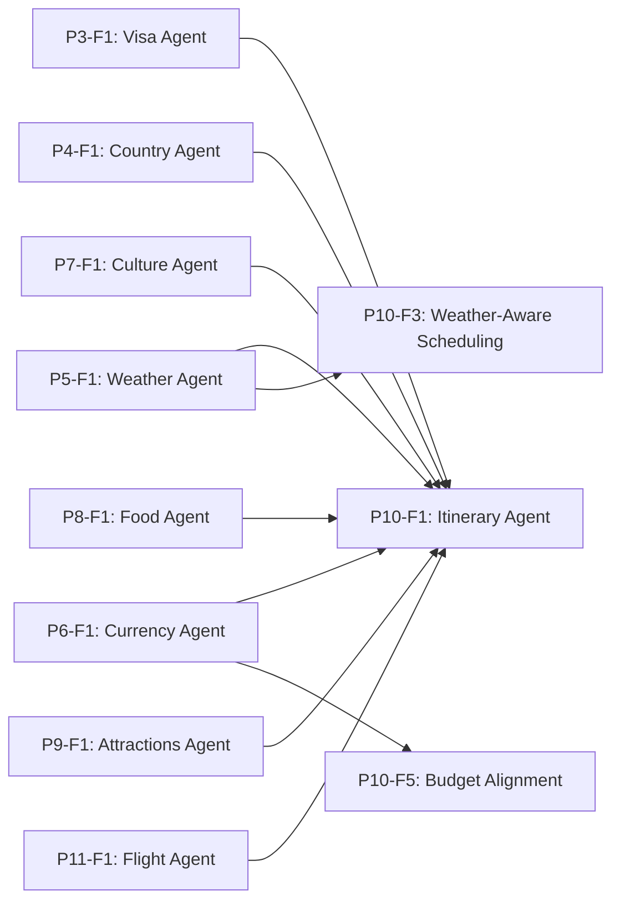
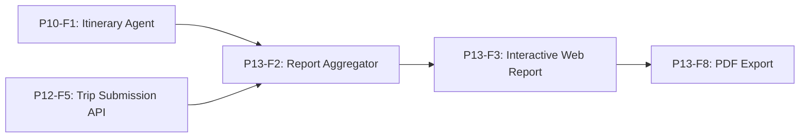

# Delivery Dependencies

**Version:** 1.0.0
**Last Updated:** 2025-12-22
**Purpose:** Documents delivery dependencies between phases and features for TIP project

---

## Overview

This document defines the **delivery dependency graph** for all phases and features. It ensures phases and features are developed in the correct order, respecting technical and functional dependencies.

**Dependency Types:**
- **Phase → Phase**: A phase cannot start until its prerequisite phases complete
- **Feature → Feature**: A feature cannot be implemented until its prerequisite features are done
- **Agent → Agent**: Some agents depend on data from other agents (documented separately in comprehensive_plan.md)

---

## Phase-Level Dependency DAG

The following Mermaid diagram shows the high-level phase dependencies:

**Legend:**
- 🟢 Green: Completed (Phase 0)
- 🟡 Yellow: Foundation (Phase 1)
- 🔵 Blue: Orchestrator (Phase 2)
- 🔴 Red: Critical Dependencies (Phases 10, 13)
- 🟣 Purple: Final Phase (Phase 15)

---

## Phase Dependency Explanation

### Phase 0 → Phase 1 (Foundation)
- **Dependency:** All research and architectural decisions must be complete before foundation work begins
- **Reason:** Foundation requires finalized tech stack, API selections, database schema, and deployment strategy
- **Satisfied:** Phase 0 is 100% complete ✅

### Phase 1 → Phases 2-12 (All Development Phases)
- **Dependency:** Foundation infrastructure must be in place before any feature development
- **Reason:** Requires Supabase (DB+Auth), Next.js (frontend), FastAPI (backend), Redis+Celery (async jobs)
- **Critical Features from Phase 1:**
  - P1-F1: Supabase project setup
  - P1-F5: Next.js frontend
  - P1-F6: FastAPI backend
  - P1-F7-F8: Redis+Celery

### Phase 2 (Orchestrator) → Phase 10 (Itinerary)
- **Dependency:** Orchestrator agent must be built before Itinerary agent
- **Reason:** Itinerary agent is the most complex, requires orchestration framework to coordinate all other agents
- **Key Feature:** P2-F3 (Create orchestrator agent)

### Phases 3-9, 11 (All Agents) → Phase 10 (Itinerary)
- **Dependency:** All individual agents must complete before Itinerary agent
- **Reason:** Itinerary agent synthesizes data from all agents (visa, weather, currency, culture, food, attractions, flights)
- **Critical Agent Features:**
  - P3-F1: Visa Agent (CRITICAL - blocking)
  - P4-F1: Country Agent
  - P5-F1: Weather Agent
  - P6-F1: Currency Agent
  - P7-F1: Culture Agent
  - P8-F1: Food Agent
  - P9-F1: Attractions Agent
  - P11-F1: Flight Agent

### Phases 10, 12 → Phase 13 (Report Generation)
- **Dependency:** Both Itinerary (P10) and Trip Creation UI (P12) must be complete
- **Reason:** Report generation requires completed itinerary data and trip submission flow
- **Key Features:**
  - P10-F1: Itinerary agent core logic
  - P12-F5: Trip submission API

### Phase 13 → Phase 14 (Data Lifecycle)
- **Dependency:** Report generation must work before implementing auto-deletion
- **Reason:** Data lifecycle manages cleanup of generated reports and trip data
- **Key Feature:** P13-F2 (Report aggregator)

### Phases 1-14 → Phase 15 (Polish & Production)
- **Dependency:** All features must be implemented and tested before final polish
- **Reason:** Production deployment, security audit, GDPR compliance require complete system
- **Blocking:** Cannot deploy to production until all phases 1-14 are done

---

## Feature-Level Dependencies (Key Examples)

### Phase 1 Foundation Dependencies

**Explanation:**
- **P1-F1 (Supabase setup)** → **P1-F2, P1-F3**: Cannot configure auth or create tables without Supabase project
- **P1-F3 (Create DB tables)** → **P1-F4 (RLS)**: RLS policies require tables to exist first
- **P1-F5 (Next.js)** → **P1-F11 (Login UI)**: Frontend framework needed for UI components
- **P1-F6 (FastAPI)** → **P1-F10 (Auth backend)**: Backend framework needed for auth endpoints
- **P1-F7-F8 (Redis+Celery)** → **P2-F5 (Job queue)**: Async infrastructure required for job system

### Phase 2 Orchestrator Dependencies

**Explanation:**
- **P2-F2 (Base class)** → **P2-F3 (Orchestrator)**: Orchestrator extends base class
- **P2-F3 (Orchestrator)** → **All agent features**: All agents use orchestrator framework

### Phase 10 Itinerary Dependencies (CRITICAL)

**Explanation:**
- **All 8 agent features** → **P10-F1 (Itinerary core)**: Itinerary requires ALL agents to be functional
- **P5-F1 (Weather)** → **P10-F3 (Weather-aware scheduling)**: Weather data needed for smart scheduling
- **P6-F1 (Currency)** → **P10-F5 (Budget alignment)**: Currency data needed for budget calculations

### Phase 13 Report Dependencies

**Explanation:**
- **P10-F1 (Itinerary)** + **P12-F5 (Trip API)** → **P13-F2 (Aggregator)**: Report aggregates itinerary and trip data
- **P13-F2 (Aggregator)** → **P13-F3 (Web report)**: Web UI displays aggregated data
- **P13-F3 (Web report)** → **P13-F8 (PDF)**: PDF renders web report

---

## Topological Order (Recommended Implementation Sequence)

Based on the dependency graph, the recommended implementation order is:

### Tier 1: Foundation (Sequential)
1. **Phase 0** (Research & Planning) → ✅ COMPLETE
2. **Phase 1** (Foundation infrastructure)

### Tier 2: Agent Framework (Sequential)
3. **Phase 2** (Orchestrator agent framework)

### Tier 3: Individual Agents (Parallel possible after Phase 2)
4. **Phase 3** (Visa Agent) - CRITICAL first
5. **Phases 4-9, 11** (Country, Weather, Currency, Culture, Food, Attractions, Flight) - Can be parallelized

### Tier 4: Integration (Sequential)
6. **Phase 12** (Trip Creation UI) - Can be parallel with agents
7. **Phase 10** (Itinerary Agent) - Requires all agents from Tier 3
8. **Phase 13** (Report Generation) - Requires Phases 10 + 12

### Tier 5: Lifecycle & Production (Sequential)
9. **Phase 14** (Data Lifecycle Management)
10. **Phase 15** (Polish & Production)

---

## Assumptions

1. **Agent Independence:** Phases 3-9 and 11 can run in parallel AFTER Phase 2 (Orchestrator) is complete
2. **Testing Per Phase:** Each phase must pass all tests before its dependents can start
3. **Critical Path:** Phase 0 → Phase 1 → Phase 2 → Phase 3 → Phase 10 → Phase 13 → Phase 14 → Phase 15
4. **Parallelization Opportunity:** Phases 4-9, 11 can be developed simultaneously after Phase 2
5. **Frontend/Backend Split:** Phase 12 (Trip UI) can be developed in parallel with agent phases
6. **Feature Granularity:** Dependencies are defined at feature level where necessary, but phases provide the primary sequencing

---

## Validation

**Acyclicity Check:** ✅ Passed (no circular dependencies detected)

**Coverage Check:** ✅ All 16 phases have defined dependencies

**Critical Path Length:** 10 phases (longest sequential path)

**Parallelization Potential:** Up to 8 phases can be developed simultaneously (Phases 4-9, 11, 12 after Phase 2)

---

**Evidence Sources:**
- feature_list.json (127 features across 16 phases)
- comprehensive_plan.md:108, :133 (agent dependency documentation)
- PRD.md:115-830 (functional requirements and journey)
